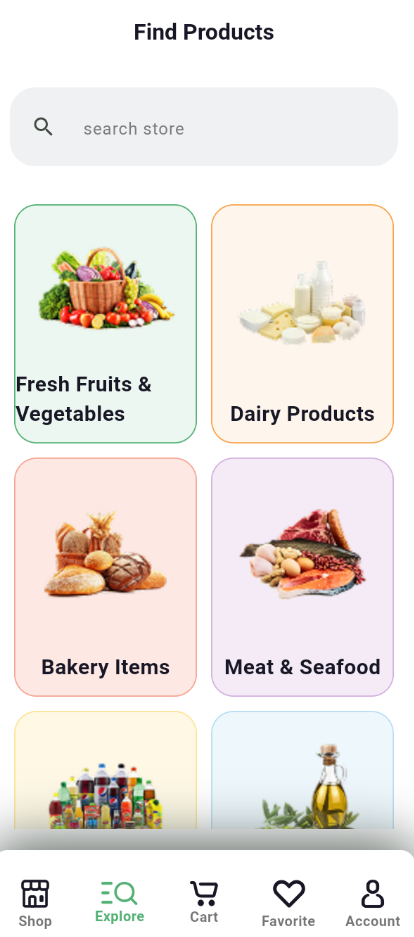
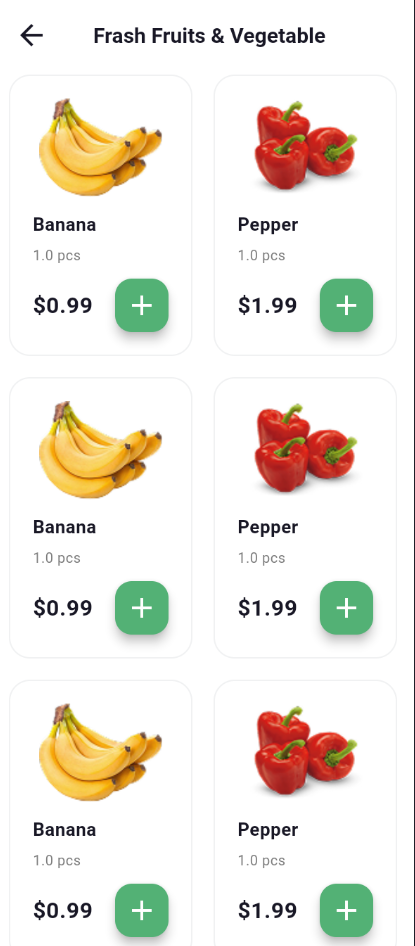
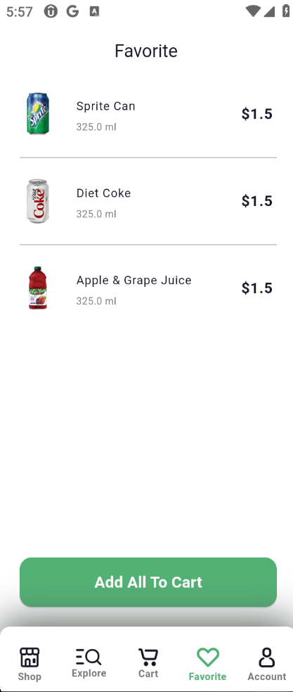
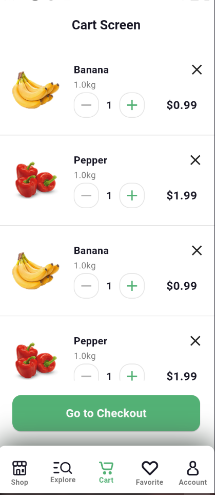
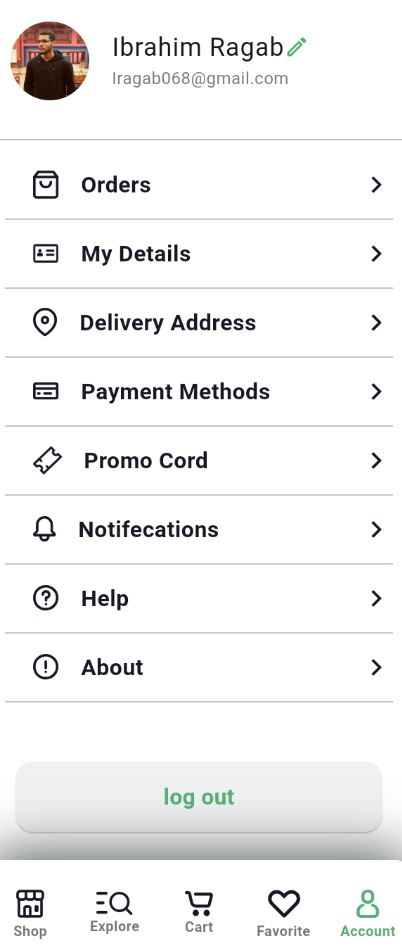

# 🛒 Green Mart App

Green Mart is a modern grocery shopping mobile application built using Flutter.  
The app provides users with a smooth, fast, and user-friendly grocery shopping experience.

---

## ✨ Features

- Splash Screen
- Welcome Screen
- Login Screen
- Sign Up Screen
- Mobile Number Screen
- OTP Verification Screen
- Main Home Screen
- Search Screen
- Categories List Screen
- Single Category Products Screen
- Favorite Screen ❤️
- Cart Screen 🛒
- Account Screen 👤
- Bottom Navigation Bar
- Clean and Modern UI
- Smooth Navigation Experience

---

## 📱 Screenshots

  
  
  
  
  
  
  
  
  
  
  
  
  

---

## 🚀 Technologies Used

- Flutter
- Dart

## 🔗 Repository Link
👉 [Green Mart GitHub Repository](https://github.com/USERNAME/REPO_NAME)

## 📌 Project Status

The project is currently under development.

### 🔜 Upcoming Features

- Checkout Process
- Payment Integration
- Backend Integration
- Order History
- State Management Integration

---

## 🔗 Repository

Replace this link with your actual repository link:

https://github.com/YOUR_USERNAME/green_mart_app
---

## 👨‍💻 Author

Ibrahim Ragab

---

### ⭐️ If you like this project, don't forget to star the repository!