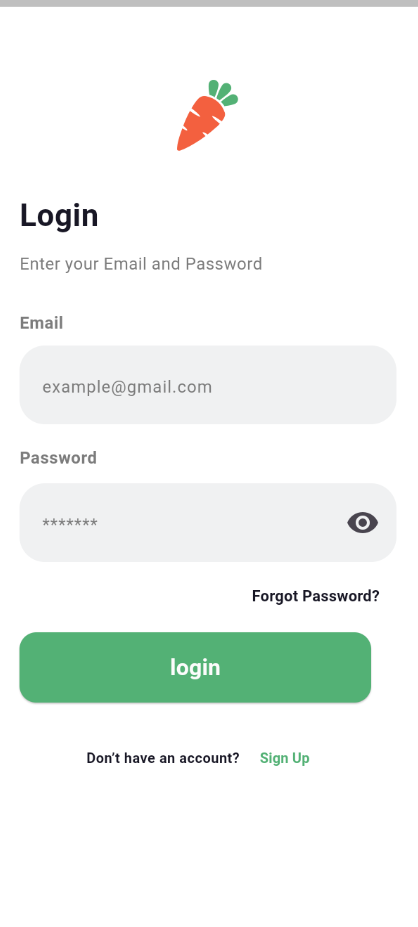
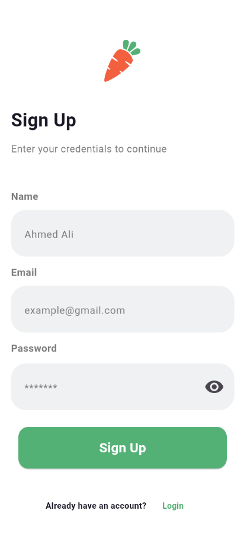
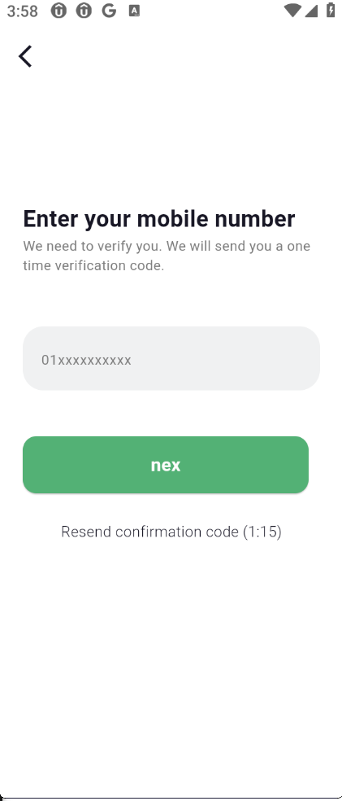
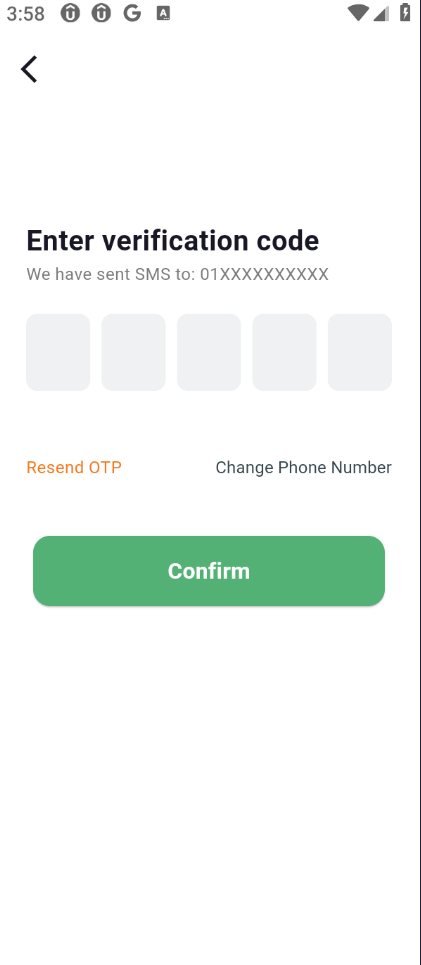
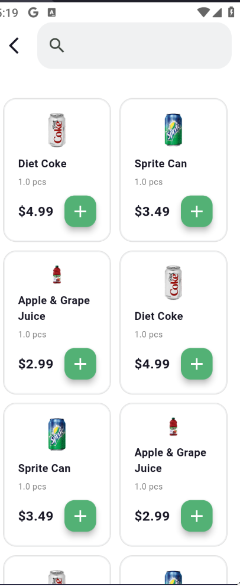

# green_mart_app

Green Mart is a modern grocery shopping mobile application built to provide users with a smooth and fast shopping experience.

## ✨ Features
- Splash Screen
- Welcome Screen
- Login Screen
- Sign Up Screen
- Mobile Number Screen
- Verification Screen (OTP)
- Main Home Screen
- Search Screen
- Bottom Navigation Bar
- Clean and user-friendly UI
- Designed for a fast grocery shopping experience

## 📱 Screenshots

  
  
  
  
  
  
  
  

## 🚀 Technologies Used
- Flutter
- Dart

## 🔗 Repository Link
👉 [Green Mart GitHub Repository](https://github.com/IbrahimRagab910/REPO_NAME)

## 📌 Project Status
The project is currently under development.  
More features will be added soon such as:
- Cart
- Checkout
- Payment Integration

## 👤 Author
- Ibrahim Ragab
